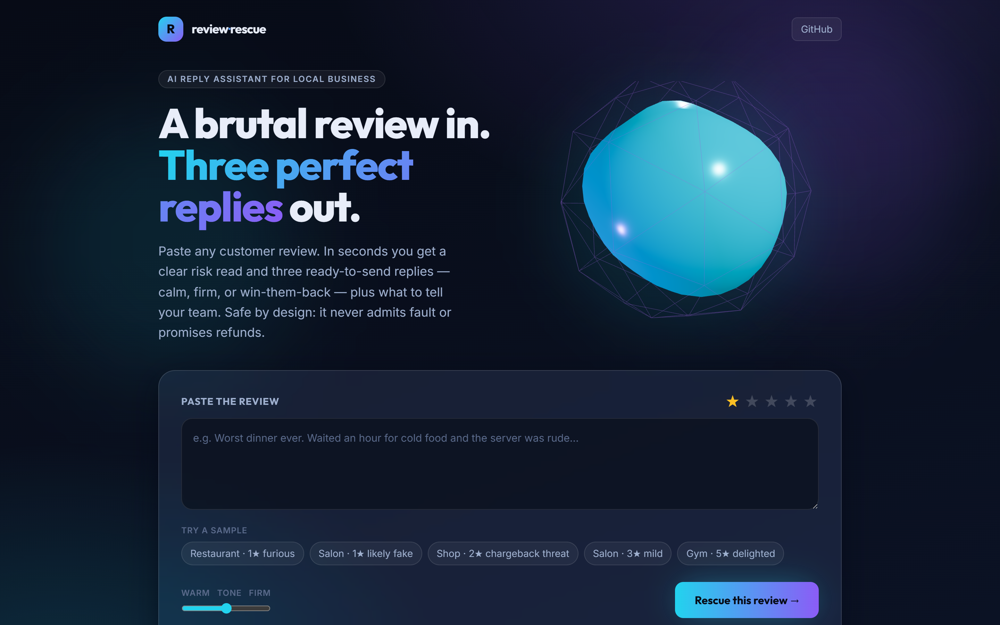
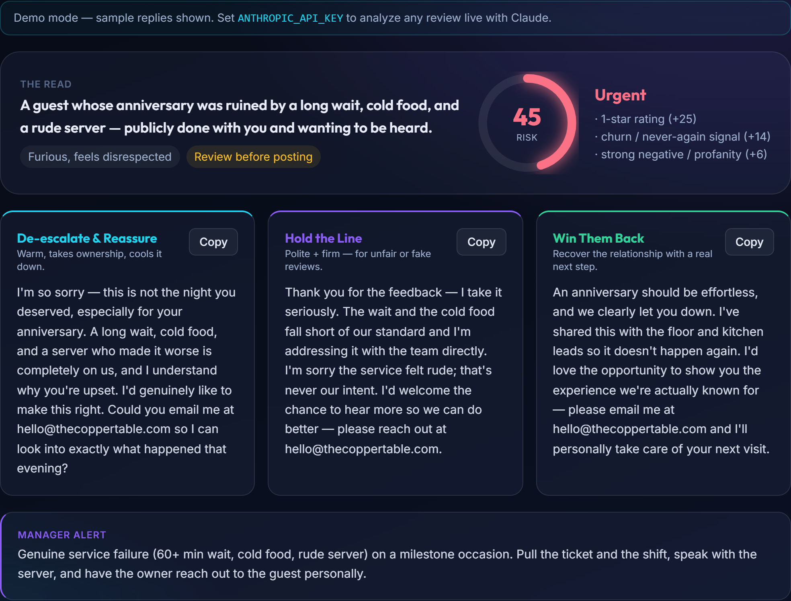
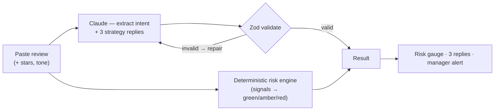
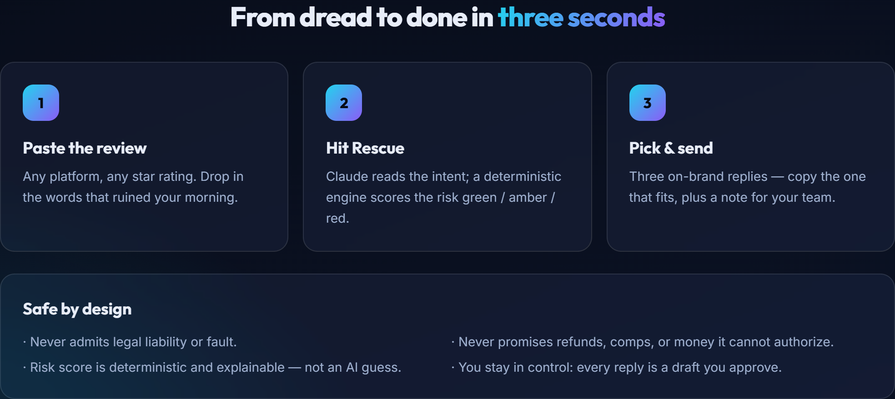

# review-rescue

**A brutal customer review in. Three perfect replies out — in seconds.**

> 🟢 **[Try the live demo →](https://review-rescue-six.vercel.app)** — paste any review, get a risk read + 3 send-ready replies. No signup; runs free in demo mode.

Paste any review and `review-rescue` reads the reviewer's intent, scores the **risk** (green / amber / red), and writes **three ready-to-send replies** — *De-escalate*, *Hold the Line*, and *Win Them Back* — plus a one-line alert for your team. Built for non-technical local-business owners (restaurants, salons, clinics, gyms, shops).

[](https://github.com/enached134-ctrl/review-rescue/actions/workflows/ci.yml)
&nbsp;[](https://review-rescue-six.vercel.app)
&nbsp;License: PolyForm Noncommercial 1.0.0 · Next.js · Claude · TypeScript · react-three-fiber



---

## The problem it kills

A 1-star review lands and your stomach drops. You either fire off something defensive you regret, or you stall for three days and look like you don't care. `review-rescue` turns that dreaded 20 minutes into 20 seconds: paste the review, hit **Rescue**, and pick the reply that fits.



## Why it's more than a clever prompt

| Concern | How it's handled | Where |
| --- | --- | --- |
| "Will it say something we'll regret?" | **Hard safety guardrails**: never admits legal liability, never promises refunds/comps, never baits trolls | [`lib/llm.ts`](lib/llm.ts) |
| "Is the AI just guessing the risk?" | **Deterministic, auditable** risk scoring — signals → score → green/amber/red, fully explainable | [`lib/risk.ts`](lib/risk.ts) |
| "What if the model returns junk?" | Forced tool call + **Zod validation + schema-guided repair loop** | [`lib/rescue.ts`](lib/rescue.ts) |
| Prompt injection via the review | The review is **fenced as untrusted data**; the model is told to ignore instructions inside it | [`lib/llm.ts`](lib/llm.ts) |
| "Can I even try it without setup?" | **Hermetic demo mode** — bundled sample reviews replay recorded responses with no API key | [`lib/fixtures.ts`](lib/fixtures.ts) |
| You stay in control | Every reply is a **draft you approve**; a "safe to auto-post" flag only ever lights green for low-risk cases | [`app/page.tsx`](app/page.tsx) |

## How it works



The LLM writes the words; a **separate deterministic function owns the risk badge**, so the rating is reproducible and explainable instead of a black-box guess.



## Quickstart

```bash
npm install
npm run dev      # http://localhost:3000  — works immediately in DEMO MODE (no key)
npm test         # hermetic unit tests (risk, schema, validate/repair)
npm run build    # production build
```

- **Demo mode (default, no key):** the bundled sample reviews return recorded responses, so the whole UI — 3D and all — is usable offline.
- **Live mode:** set `ANTHROPIC_API_KEY` (see [`.env.example`](.env.example)) to analyze *any* pasted review with Claude.

## Tech

Next.js (App Router) · React · TypeScript · Tailwind CSS · **react-three-fiber** (the glass-shield hero) · **Claude (Anthropic) API** with tool-use + validate/repair · Zod · Vitest · GitHub Actions CI.

## Project layout

```
app/
  page.tsx            the wow UI — 3D hero, paste-and-rescue console, results
  api/rescue/route.ts live Claude (with key) or hermetic demo replay (without)
  layout.tsx, globals.css
components/            Shield3D (WebGL hero), RiskGauge, ReplyCard
lib/
  schema.ts           Zod contracts + the Claude tool schema (kept in sync by a test)
  llm.ts              Claude client (safety-fenced prompt) + ReplayReplyLLM
  risk.ts             deterministic, auditable risk scoring
  rescue.ts           orchestration: analyze (validate/repair) → risk → safe-to-post
  fixtures.ts         realistic demo + test data (hermetic)
tests/                Vitest unit suite
```

## License

[PolyForm Noncommercial 1.0.0](LICENSE) — source-available for study and noncommercial use; not a free product to repackage and resell. For commercial use, contact me.

— Daniel Enache · [github.com/enached134-ctrl](https://github.com/enached134-ctrl)
